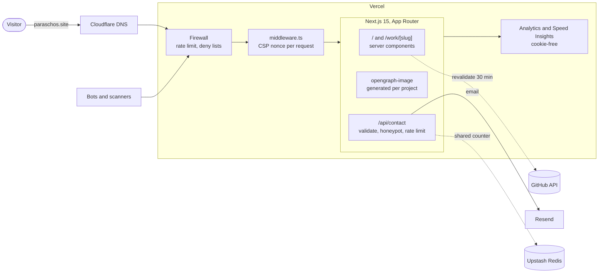

# paraschos.site

[](https://github.com/paraschosg/paraschos-site-v2/actions/workflows/ci.yml)

Personal site of George Paraschos. Next.js 15 (App Router), React 19, plain CSS with custom properties, self-hosted fonts.

## Run

```bash
npm install
cp .env.example .env.local   # fill in RESEND_API_KEY for the contact form
npm run dev
```

Run the end-to-end tests against a production build:

```bash
npm run build && npm test
```

## Architecture



Everything the visitor sees is rendered on the server. The client ships one
small bundle (about 108 kB gzipped, enforced in CI) for the terminal, palette,
theme toggle and form. `lib/content.ts` is the single source of truth: the
homepage, project pages, OG images, sitemap and terminal all read from it.

## What's in here

- **Theme** — `data-theme` on `<html>`, set by an inline script before first paint (no flash), persisted in `localStorage`, defaults to `prefers-color-scheme`.
- **Terminal** — the hero. `help`, `whoami`, `projects`, `open <project|section>`, `stack`, `contact`, `theme`, `history`, `clear`. Tab completion, arrow-key history, Ctrl+L.
- **Command palette** — `⌘K` / `Ctrl+K`. Keyboard-navigable listbox with proper ARIA.
- **GitHub section** — React Server Component, fetched with `next: { revalidate: 1800 }`. Visitors never hit the GitHub API. Degrades to a link if the API is down.
- **Contact form** — client validation → `POST /api/contact` → server validation, honeypot, per-IP rate limit, delivery via Resend.
- **Project pages** — `/work/[slug]`, statically generated from `lib/content.ts` via `generateStaticParams`. Each has its own metadata and a generated OG image (`app/work/[slug]/opengraph-image.tsx`), so shared links show a per-project card.
- **SEO/meta** — `generateMetadata`, generated `opengraph-image.tsx`, `sitemap.ts`, `robots.ts`, JSON-LD `Person`.
- **Tests** — Playwright end-to-end suite in `tests/`, run against the production build on desktop and mobile viewports: terminal, command palette, theme persistence, contact form validation and states, API validation and honeypot, project pages and OG images, 404, security headers, and a clean console under CSP. `npm test` locally.
- **CI** — every push runs type checking, a production build, a gzipped bundle budget (`scripts/check-bundle.mjs`, 120 kB ceiling), the Playwright suite, and Lighthouse against the homepage and a project page. Thresholds live in `.lighthouserc.json`; accessibility and SEO must score 100.
- **Analytics** — Vercel Analytics and Speed Insights. No cookies, no cross-site identifiers, so no consent banner is required.
- **Security headers** — static ones in `next.config.ts`; `Content-Security-Policy` in `middleware.ts` with a per-request nonce and `'strict-dynamic'`, so no `'unsafe-inline'` for scripts. Pages are rendered per request as a result.
- **Rate limiting** — two layers. A Vercel WAF rule on `/api/contact` (edge, before the function runs), and `lib/ratelimit.ts` inside the function: Upstash Redis when configured, per-instance memory otherwise.
- **Accessibility** — skip link, landmarks, visible focus, `prefers-reduced-motion`, labelled form fields with `aria-invalid`/`aria-describedby`.

## Deploy

Push to GitHub, import in Vercel, add the env vars from `.env.example`. Point `contact@paraschos.site` at a verified Resend domain (or change `from` in `app/api/contact/route.ts`).

## Releases

Commits on `main` follow [Conventional Commits](https://www.conventionalcommits.org):

```
feat: add print stylesheet          → minor release
fix: palette focus trap on mobile   → patch release
feat!: drop the terminal            → major release
chore: bump deps / docs: … / ci: …  → no release
```

[release-please](https://github.com/googleapis/release-please) watches `main`
and keeps a release PR open with the version bump and `CHANGELOG.md` entries.
Merging it tags the release. Nothing is published manually.
